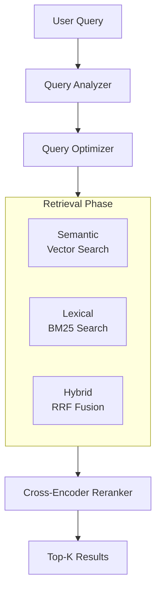
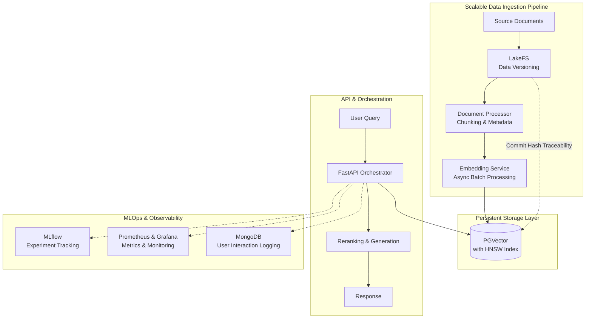

# Plan Instructions

The bottleneck we're facing is vectorizing documents one by one, which is a classic sign that has outgrown a local, script-based RAG prototype. Moving to a production-standard system requires rethinking two core areas: scalable processing for data ingestion and robust MLOps practices for versioning, evaluation, and observability.

The `open-rag-stack` project provides an excellent blueprint, combining all the necessary tools for a production-ready system

Key technical components of this architecture include:

- Query Optimization: This pre-retrieval step analyzes user intent and expands queries with synonyms or related terms to improve match rates .

- Multi-Strategy Retrieval: Relying solely on vector search often misses exact keywords (like product codes). Production systems combine approaches using Reciprocal Rank Fusion (RRF) to merge results from semantic and lexical search for higher recall than either method alone .

- Reranking: After pulling an initial set of candidates (e.g., top-50), a cross-encoder model re-scores them to push the most relevant documents to the top. This significantly boosts precision without sacrificing recall of relevant information .

- Evaluation Framework: You cannot improve what you do not measure. Production systems implement evaluation suites to track metrics like Precision@K, Recall@K, MRR, and NDCG@K against test datasets .

## Leveraging GitHub Development Benefits

Instead of building these components manually, you can stand on the shoulders of open-source giants. The repository `KazKozDev/production-rag` is an excellent blueprint. It is an MIT-licensed, complete implementation of the architecture described above

##  The Production RAG Architecture

Here is the architectural blueprint for your production RAG system, focusing on the components that solve your specific challenges.

### Solving the Vectorization Bottleneck

Your immediate need is speed. Here's how to move from "one by one" to high-throughput processing.

**1. Use Bulk Processing with Parallelization**

The core issue is that you're likely inserting vectors one at a time. For a production system, you must use bulk operations.

The Pattern: Use the psycopg2.extras.execute_values() function to insert thousands of vectors in a single database roundtrip . Then, distribute this work across multiple CPU cores.

Implementation Strategy: If you're using a data processing framework like Apache Spark (e.g., on Azure Databricks), you can repartition your dataset and have each core execute a bulk upsert on its own partition . For a simpler approach, Python's multiprocessing library can be used to parallelize the ingestion of multiple files or document batches.

**2. Optimize Your Indexing Strategy**

Your database indexes are crucial for fast queries, but building them can be slow. A common mistake is to build the index first and then insert data.

- Golden Rule: Always load all your data into the table before creating the index. Creating an index on a populated table is significantly faster and produces a more optimized data layout than inserting data into an already-indexed table .

- Choose the Right Index: For your use case, the HNSW index is generally preferred for production due to its superior speed-recall trade-off, though it takes longer to build than IVFFlat .
    - To speed up the HNSW build specifically, you can increase the number of parallel workers PostgreSQL uses. You can experiment with setting hnsw.parallel_workers_for_build to a higher number to leverage more CPU cores during this intensive process .

## Adopting an MLOps Stack for RAG

Once ingestion is fast, you need the tools to manage, evaluate, and monitor your system. This is where MLOps delivers its benefits.

The `open-rag-stack` GitHub repository is a perfect blueprint for this. It's a playground that implements all the following best practices .

- Data & Artifact Versioning (LakeFS): This is critical for your "documents in the targeted field." LakeFS version-controls your documents. When you ingest a new version of a document, it creates a commit hash. This hash is stored alongside the embedding in PGVector, ensuring every answer can be traced back to the exact version of the source document. This eliminates "modeling debt" and makes debugging and compliance possible .

- Experiment Tracking (MLflow): Your local script likely has no record of which chunk size or embedding model worked best. MLflow logs every run: parameters (chunk_size, top_k), metrics (context_precision), and artifacts. This allows you to scientifically compare configurations and roll back to a known good state .

- Evaluation Framework (Ragas/MLflow): A production system needs automated evaluation. You can log user queries and the retrieved context to a store like MongoDB . Using a framework like RAG Pilot, you can then tune hyperparameters (chunk_size, top_k, embedding_model) and measure their impact on metrics like Context Precision (are the retrieved docs relevant?) and Answer Relevancy (does the answer address the query?) .

- Observability (Prometheus + Grafana): When your system is live, you need to see inside it. Prometheus scrapes metrics like ingestion latency, query processing time, and error rates. Grafana visualizes these on a dashboard, giving you real-time insight into system health and performance .

## The Deployment Artifact (Docker)
To ensure this stack runs reliably anywhere (your dev machine, a staging server, or the cloud), you must containerize it.

- The Standard: The entire stack—FastAPI orchestrator, BentoML model services, PGVector, and all the MLOps tools—can be defined and run using docker-compose.yml .

- The Benefit: With one command (docker-compose up --build), you can spin up the entire production environment. This eliminates "works on my machine" problems and makes scaling to a Kubernetes cluster in the cloud a straightforward next step .