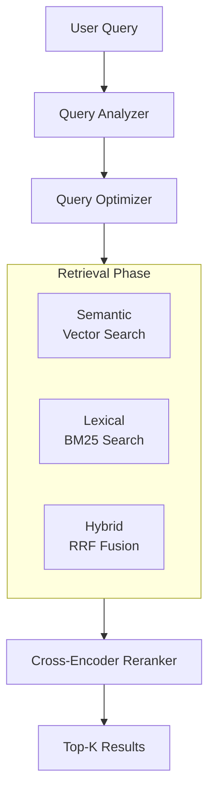
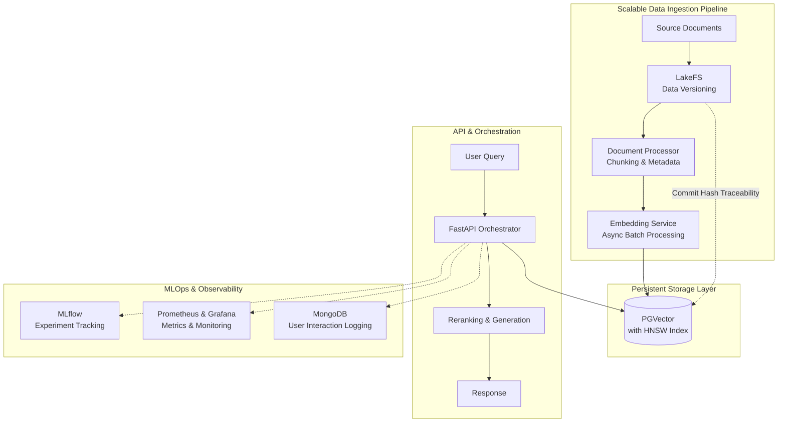

# Tesachor RAG Engine – Production Workflow

This project implements a production-grade Retrieval-Augmented Generation (RAG) system, designed for scalable data ingestion, robust retrieval, and full MLOps observability. The architecture is inspired by best practices from open-source blueprints such as `open-rag-stack` and `KazKozDev/production-rag`.

---

## Quick Start

1. **Install dependencies**
2. **Configure environment variables** (see below)
3. **Build the vector store**
4. **Run the API service**

---

## System Architecture

### High-Level Workflow



### Production RAG Stack



---

## Key Features

- **Bulk, Parallel Ingestion:** High-throughput document processing and vectorization using batch operations and multiprocessing.
- **Data Versioning:** LakeFS ensures every document and embedding is version-controlled and traceable.
- **Multi-Strategy Retrieval:** Combines semantic (vector), lexical (BM25), and hybrid (RRF) search for high recall and precision.
- **Reranking:** Cross-encoder models reorder candidates for optimal relevance.
- **Evaluation & Experiment Tracking:** MLflow and Ragas/MLflow for tracking metrics (Precision@K, Recall@K, MRR, NDCG@K) and experiment parameters.
- **Observability:** Prometheus and Grafana for real-time monitoring; MongoDB for logging user interactions.
- **Containerized Deployment:** All services orchestrated via Docker Compose for reproducibility and scalability.

---

## Usage

### 1. Install Dependencies

Install Python and project dependencies as required by your environment.

### 2. Configure Environment Variables

Set the following variables as needed:

```env
HF_LLM_ENDPOINT=https://api.featherless.ai/v1/chat/completions
HF_LLM_PROVIDER=featherless-ai
LLM_MODEL=HuggingFaceH4/zephyr-7b-beta
FEATHERLESS_API_KEY=your_featherless_api_key
HF_API_TOKEN=your_hf_token
```

### 3. Build the Vector Store

```bash
uv run python scripts/build_vectorstore.py
```

This processes the dataset and builds the vector store for the RAG engine.

### 4. Run the API Service

```bash
uvicorn app.main:app --host 0.0.0.0 --port 8001
```

---

## Development & Deployment

- All services (API, embedding, ingestion, monitoring, etc.) are containerized. Use `docker-compose up --build` to launch the full stack.
- For scaling and cloud deployment, the stack is Kubernetes-ready.

---

## Notes & Q&A

**Q: Why do a few records produce many chunks?**

A: Each record may be a conversation thread. The chunking process creates a chunk for every assistant response, so the number of chunks depends on the number of assistant turns, not the number of records.

---

## File Structure

See the repository for a detailed breakdown of scripts, services, and data folders.

---

## References

- [open-rag-stack](https://github.com/jerryjliu/open-rag-stack)
- [KazKozDev/production-rag](https://github.com/KazKozDev/production-rag)

## Development Notes [!IMPORTANT]

Only up the services you need, not all, ok!

**Scenario 1:** Up the impmediate dependencies for building the vector store:

```bash
docker-compose up -d postgres redis pgadmin
```

**Scenario 2:** When monitoring the API service, add the monitoring stack:

```bash
docker-compose up -d postgres redis pgadmin prometheus grafana
```

**Scenario 3:** For full stack development and testing, up all services:

```bash
docker-compose up -d
```

**Among Each Scenario:** There will be some needed to build the any service that is primarily updated. In this, use:

```bash
docker-compose up -d --build <service_name>
```

**Run main services natively:**

+ For each service (`api`, `embedding`, `ingestion`):

    Create a Python 3.11+ virtual environment.
    
    Install dependencies using `uv add` in each service directory.
    Set required environment variables (e.g., database and Redis URLs, embedding service URL, model names, API keys).
    
    Start services:
    
    ```bash
    cd services/embedding
    source .venv/Scripts/activate
    uv run uvicorn app:app --host 0.0.0.0 --port 8080 --reload
    ```

    ```bash
    cd services/api
    source .venv/Scripts/activate
    uv run uvicorn app.main:app --host 0.0.0.0 --port 8000 --reload
    ```
    
    ```bash
    cd services/ingestion
    source .venv/Scripts/activate
    uv run celery -A worker worker --loglevel=info --concurrency=4

    // for my machine
    uv run celery -A worker worker --loglevel=info --pool=solo
    ```

    ```bash
    cd services/llm
    source .venv/Scripts/activate
    uv run uvicorn app:app --host

    uv run uvicorn app:app --host 0.0.0.0 --port 8002 --reload
    ```


    ====

     1. Infrastructure (Docker)
  Start the database (Postgres + pgvector) and the message broker (Redis).
   1 docker-compose up -d postgres redis

  2. LLM Service (Port 8002)

   1 cd services/llm
   2 uv sync
   3 uv run python app.py

  3. Embedding Service (Port 8080)

   1 cd services/embedding
   2 uv sync
   3 uv run uvicorn app:app --port 8080

  4. Ingestion Worker (Celery)

   1 cd services/ingestion
   2 uv sync
   3 uv run celery -A worker worker --loglevel=info

  5. API Service (Port 8000)

   1 cd services/api
   2 uv sync
   3 uv run uvicorn app.main:app --port 8000