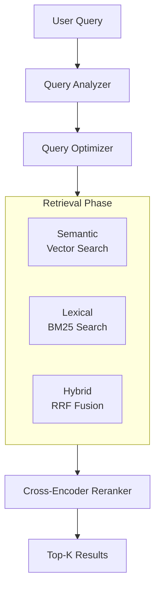

# Tesachor RAG Engine

A production-grade Retrieval-Augmented Generation (RAG) system for scalable data ingestion, robust retrieval, and full MLOps observability. Inspired by [open-rag-stack](https://github.com/jerryjliu/open-rag-stack) and [KazKozDev/production-rag](https://github.com/KazKozDev/production-rag).

---

## Features

- **Bulk, Parallel Ingestion:** High-throughput document processing and vectorization.
- **Data Versioning:** LakeFS for version control and traceability.
- **Multi-Strategy Retrieval:** Semantic (vector), lexical (BM25), and hybrid (RRF) search.
- **Reranking:** Cross-encoder models for optimal relevance.
- **Experiment Tracking:** MLflow and Ragas for evaluation metrics.
- **Observability:** Prometheus, Grafana, and MongoDB for monitoring and logging.
- **Containerized:** All services orchestrated via Docker Compose.

---

## Architecture

### High-Level Workflow



### Stack Overview

- **Data Ingestion:** LakeFS, chunking, embedding (async batch)
- **Storage:** PGVector (HNSW index)
- **Serving:** FastAPI orchestrator, reranking, LLM generation
- **Observability:** MLflow, Prometheus, Grafana, MongoDB

---

## Getting Started

### 1. Install Dependencies

- Python 3.11+ required.
- Each service (`api`, `embedding`, `ingestion`, `llm`) uses its own virtual environment.
- Install [uv](https://github.com/astral-sh/uv) for dependency management.

```bash
# Example for embedding service
cd services/<service-name>
uv venv .venv
uv sync
source .venv/Scripts/activate  # or .venv/bin/activate on Unix
```

### 2. Environment Variables

Each service manages its own `.env` file. See the service folder for examples. Common variables include:

- `REDIS_URL` (API, ingestion): Redis connection string for Celery
- `PGVECTOR_DSN` (ingestion): Postgres connection string for vector DB
- `EMBEDDING_SERVICE_URL` (ingestion): URL for embedding service
- `EMBEDDING_PROVIDER`, `EMBEDDING_MODEL_NAME`, `EMBEDDING_API_KEY` (embedding)
- `LLM_PROVIDER`, `LLM_MODEL_NAME`, `LLM_API_KEY`, `LLM_API_BASE_URL` (llm)

There is no global `.env.example`. Set variables as needed per service.

### 3. Ingest Data

Use the provided scripts to ingest documents:

- Bulk ingest PDFs (requires LakeFS) $\rightarrow$ Future Work (refer to [Monitoring & Versioning](#monitoring) for tracking ingestion experiments):

  ```bash
  uv run python scripts/bulk_ingest.py
  ```

- Ingest JSONL data via API:

  ```bash
  uv run python scripts/ingest_jsonl.py <path-to-jsonl>
  ```
  Note the structuer of the JSONL file should be an array of records, where each record is a conversation thread. Each thread may contain multiple turns, and chunking will create a chunk for every assistant response, which is why a few records can produce many chunks.

    ```json
    {
        "content": document content (e.g. question and answer),
        "metadata": {
                "name": document name or title, 
                "type": document type or category, 
                "source": original source or filename, 
                "system_message": a system message describing the context or role for the document (e.g. "You are a knowledgeable and friendly Cambodia tourism assistant. Provide accurate, helpful, and engaging information about Cambodia's attractions, culture, history, and travel tips.") 
                # Optional but can be used to provide additional context for the document during retrieval and generation
            },
        "conversation_id": a unique identifier for the conversation thread (e.g. "_part_1.jsonl"), 
        "turn": the turn number within the conversation thread (e.g. 2 for the second turn)
    }
    ...
    ...
    ```
  Example:

    ```json
        {
            "content": "Question: What are the top attractions in Cambodia?\nAnswer: Cambodia is home to many incredible attractions. The most famous is Angkor Wat, a UNESCO World Heritage site and one of the largest religious monuments in the world. Other must-see attractions include the Royal Palace in Phnom Penh, the Killing Fields, and the beautiful beaches of Sihanoukville.",
            "metadata": {
                    "name": "Cambodia Tourism Information", 
                    "type": "General Tourism", 
                    "source": "_part_1.jsonl", 
                    "system_message": "You are a knowledgeable and friendly Cambodia tourism assistant. Provide accurate, helpful, and engaging information about Cambodia's attractions, culture, history, and travel tips."
                },
            "conversation_id": "_part_1.jsonl", 
            "turn": 2
        }
        ...
        ...

    ```

    Ohh, this is a bit confusing, since the content field contains both the question and answer. This is because the system was previous designed for fine-tuning, where the question and answer are concatenated together as the input-output pair. But during the work, we were very struggle to fine-tune a good model owing to the machine learning expertise and resource constraints.
    
    However, we then change the tool to RAG-based system, it may be more effective to separate the question and answer into different fields. For example, we can have a `question` field and an `answer` field, which can make the data structure more clear and easier to process during retrieval and generation. 

    We've have make it scalable and customizable, so you can tweak with the data structure as needed for your specific use case. Just make sure to update the ingestion and retrieval logic accordingly to handle the new fields.

    We suggest you implement hybrid methods, RAG + fine-tuning, to achieve better specialization performance. You can use the RAG system to quickly retrieve relevant documents and generate responses, while also fine-tuning a smaller model on your specific dataset to further improve accuracy and relevance.


    #### Postman
    You can also use Postman to test the API endpoints for ingestion and querying. Just set up the appropriate request with the required headers and body, and you can easily send requests to your local API service to verify that everything is working as expected.

    Via `{{API_BASE_URL}}/ingest` endpoint, you can send a POST request with the JSONL data in the body to ingest documents into the system. Make sure to set the `Content-Type` header to `application/json` and include any necessary authentication headers if your API service requires them.

    ```json

    ```

### 4. Run Services

#### Docker Compose (Recommended)

- Start core infrastructure (Current Development Focus):

  ```bash
  docker-compose up -d postgres redis pgadmin
  ```

- Add monitoring stack (Future Work but added already):

  ```bash
  docker-compose up -d prometheus grafana
  ```

- Full stack:

  ```bash
  docker-compose up -d --build
  ```

#### Native (Development)

- **Embedding Service:** 

    For Windows:
   `cd services/embedding && source .venv/Scripts/activate && uv run uvicorn app:app --host 0.0.0.0 --port 8080 --reload`

    For WSL Ubuntu (Linux):
    `cd services/embedding && source .venv/bin/activate && uv run uvicorn app:app --host 0.0.0.0 --port 8080 --reload`

- **API Service:**  

    For Windows:
   `cd services/api && source .venv/Scripts/activate && uv run uvicorn app.main:app --host 0.0.0.0 --port 8000 --reload`

    For WSL Ubuntu (Linux):
    `cd services/api && source .venv/bin/activate && uv run uvicorn app.main:app --host 0.0.0.0 --port 8000 --reload`
- **LLM Service:**
    For Windows:  
   `cd services/llm && source .venv/Scripts/activate && uv run uvicorn app:app --host 0.0.0.0 --port 8002 --reload`

    For WSL Ubuntu (Linux):
    `cd services/llm && source .venv/bin/activate && uv run uvicorn app:app --host 0.0.0.0 --port 8002 --reload`
- **Ingestion Worker:**  

    For Windows:
   `cd services/ingestion && source .venv/Scripts/activate && uv run celery -A worker worker --loglevel=info --pool=solo`

    For WSL Ubuntu (Linux):
    `cd services/ingestion && source .venv/bin/activate && uv run celery -A worker worker --loglevel=info --concurrency=4`
---

## Data & Scripts

- **Data:**
  - `data/rag_documents.jsonl` — Source documents
  - `data/transformed/` — Chunked/processed data
  - `data/vector_db/` — Vector database (Chroma, PGVector, etc.)

- **Scripts:**
  - `scripts/bulk_ingest.py` — Bulk ingest with LakeFS versioning (PDFs)
  - `scripts/ingest_jsonl.py` — Ingest JSONL data via API

---

## Service Endpoints & Configuration

- **API Service:** `/query` (question answering), `/ingest` (document ingestion)
- **Embedding Service:** `/encode` (batch embeddings)
- **LLM Service:** `/generate` (text generation)
- **Ingestion Worker:** Celery task queue for background ingestion

Each service loads configuration from its own `.env` file and `config.py`.

---

## Monitoring

- **Prometheus & Grafana:**
  - Config: `services/monitoring/prometheus.yml`
  - Dashboards: `services/monitoring/grafana/dashboards/`

---

## FAQ

**Why do a few records produce many chunks?**  
Each record may be a conversation thread. Chunking creates a chunk for every assistant response, so the number of chunks depends on the number of assistant turns.

---

## References

- [open-rag-stack](https://github.com/jerryjliu/open-rag-stack)
- [KazKozDev/production-rag](https://github.com/KazKozDev/production-rag)

---

All by [FAKERS.org](https://github.com/FAKERS-org)